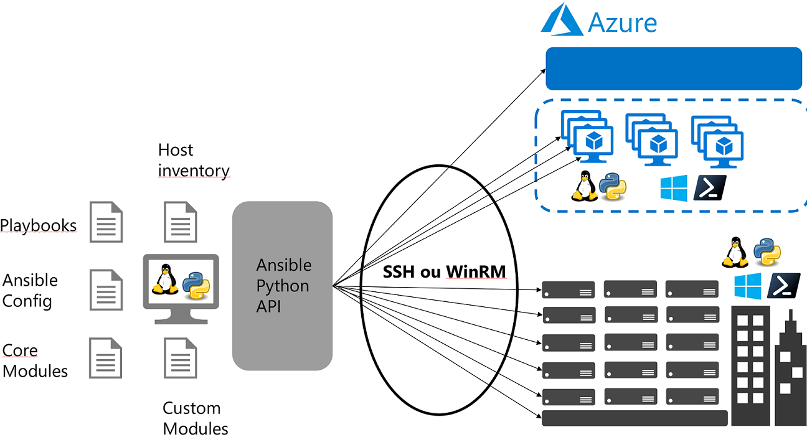

 

## Ansible dans un environnement Azure 
Avant de parler d'Ansible dans un environnement Azure, voici une petite introduction. Ansible est une plate-forme pour la configuration et la gestion de multiples environements d'architectures. Ansible combine le déploiement de logiciels "multi-noeud", l'exécution de tâches ad-hoc et la gestion de configuration. C'est un produit open-source qui appartient à Red Hat depuis octobre 2015.  

L'achitecture Ansible s'appuie sur deux éléménts principaux: 
Le ___"control node"___ ou ___serveur Ansible___ peut être exécuté à partir des environnements Python 2 (vers 2.7) ou Python 3 (vers 3.5 +). Le "control node" Ansible s'exécute uniquement depuis d'un environnement Linux (Red Hat, Debian, CentOS, macOS, BSD, WSL ...). Les configurations appelées "Playbooks"sont écrites en YAML. L'écriture des "Playbooks" s'appuie soit sur des modules natifs à Ansible ou sur des modules contenu dans des collections (ex: Galaxy Collection Azure "azure.azcollection"). Les "playbooks" sont ensuite envoyés en SSH/WinRM sur les machines cibles en s'appuyant sur un inventaire.  

Les ___"managed nodes"___ ou ___serveurs cibles___ peuvent être des environnements Linux ou Windows: 
 -Pour les environnements Linux, les "playbooks" s'exécuteront en Python et seront récupérés en SSH. 
 -Pour les environement Windows, les "playbooks" s'exécuteront en PowerShell et seront récupérés en WinRM ou SSH (SSH disponible dans Windows Server 2019). 

A la différence d'autres solutions du marché (Puppet, Chef, ...), Ansible est "agentless" pas besoin d'installer d'agent sur les serveurs cibles. 

 

Il existe deux versions d’Ansible, <a href="www.ansible.com/community">la version communautaire</a> et la version entreprise proposée par Red Hat la <a href="www.redhat.com/fr/technologies/management/ansible">"Red Hat Ansible Automation Platform".</a>
Cette dernière s’appuie sur les composants:  
 - <a href="https://www.ansible.com/products/engine">"Ansible Engine".</a> 
 - <a href="https://www.ansible.com/resources/webinars-training/collections-future-of-how-ansible-content-is-handled">"Ansible Content Collection".</a>  
 - <a href="https://www.ansible.com/products/tower">"Ansible Tower".</a> 
 - <a href="https://www.redhat.com/cms/managed-files/ma-network-automation-for-everyone-e-book-f14954-201812-a4-fr.pdf">"Ansible Network Automation".</a> 
 - <a href="https://www.ansible.com/products/automation-analytics">"Automation Analytics".</a>  
Ansible présente de nombreuses qualités, sa plus grande, est sa facilité d'accès: 
- Le YAML, c'est lisible par l’homme et cela ne nécessite pas de   connaissance ou compétence particulier en codage. 
- Pas besoin d'agent à installer sur les serveurs cibles les configurations s'éxecutent en Python ou en PowerShell et on utilise OpenSSh et WinRM pour pousser les configurations. 
- Facile à prendre en main, on écrit les configuration en "mode déclaratif" et les "Playbooks" sont idempotents. 
- Un grand nombre de  <a href="https://docs.ansible.com/ansible/2.9/modules/list_of_all_modules.html"> modules </a> sont déjà disponibles quand on installe Ansible ensuite il existe un grand nombre de modules disponibes proposés par la communeauté Ansible sur <a href="https://galaxy.ansible.com/">"Ansible Galaxy".</a> (collections, roles ...)  
- Il est simple d'utiliser Ansible dans des chaînes de déploiement pour industrialiser les déploiements (pipeline, workflows, ...), il est présent par exemple dans les "runners de GitHub Actions" ou dans les "agents Azure Devops"  
On execute les "Playbooks" soit en "command line" ou soit GUI avec des solutions comme <a href="https://www.ansible.com/products/tower">"Ansible Tower"</a> (Red Hat) ou son pendant <a href="https://github.com/ansible/awx">"AWX".</a> (La version communeautaire de Ansible Tower)

## Ansible et Azure ##
Ansible est une excellente solution pour déployer et configurer des infrastructures dans Azure. Il est présent dans le "Cloud Shell" d'Azure et il existe une VM . Voici plusieurs scénarios ou Ansible pourra vous faciliter la tâche dans les déploimments et les configurations de vos infrastructures dans Azure 

### Ansible pour déployer des ressources dans Azure (IaC) 
On peut utiliser Ansible pour déployer des ressources dans Azure en "Infrastructure as Code". C'est un scénario un peu moins répandu du fait de la monté en puissance d'outils comme Terraform. 
Pour configurer le "control node" ou serveur Ansible (serveur local ou VM Azure) il faudra installer: 
. le gestionnaire de packets "python3-pip" 
. Ansible 
. les collections Azure (modules Azure). En effet depuis la version d'Ansible 2.10 les modules pour Azure sont séparés de la version Ansible de base. 
. Créer un "Service Principal" pour la connexion entre le poste Ansible et l'abonnement Azure  
 <a href="https://github.com/Pierre-Chesne/Ansible_Azure/tree/main/Installation"> Voici une procédure pour l'installation pour une distribution Linux Ubuntu 18.04 LTS avec un test de création d'un "ressource groupe" </a>  
 Voici d'autres exemples de déploiment : 
 . <a href="https://github.com/Pierre-Chesne/Ansible_Azure/tree/main/Playbooks/IaC/VM"> Création d'une VM </a> 
 . <a href="https://github.com/Pierre-Chesne/Ansible_Azure/tree/main/Playbooks/IaC/VMSS"> Création d'un Scale Set de VM</a> 
 . <a href="https://github.com/Pierre-Chesne/Ansible_Azure/tree/main/Playbooks/IaC/Mysql">Création d'une Azure Database for MySQL</a> 
 . <a href="https://github.com/Pierre-Chesne/Ansible_Azure/tree/main/Playbooks/IaC/AppService">Création d'une App Service</a> 
 . <a href="https://github.com/Pierre-Chesne/Ansible_Azure/tree/main/Playbooks/IaC/AKS">Création d'un cluster AKS</a> 
 On peut également utiliser les APIs REST d'Azure dans un "playbook" avec le module ``azure.azcollection.azure_rm_resource`` pour déployer  
 . <a href="https://github.com/Pierre-Chesne/Ansible_Azure/tree/main/Playbooks/IaC/API">Création de ressource Azure via les APIs</a>  

 ### Ansible sur un poste ou serveur "on-premise" ou dans une VM Azure 
 Dans ce scénario on peut utiliser Ansible pour installer et configurer les applications dans des infrastructures s'executant dans Azure (Base de donnée, Serveur Web, VM...). Pour pouvoir pousser les configurations aux hosts cibles il faut: 
 . Ecrire un "playbook" 
 . Faire un inventaire (liste des hosts cibles) 
 . Exécuter le "playbook" en s'appuyant sur l'inventaire. 
 Pour pousser les "playbooks" sur les machines cibles, on utilise SSH, cela nécessite avoir tous les prérequis sur ces dernières (clés SSH et port TCP de connexion).   

### - Ansible dans des chaînes de déploiement 

